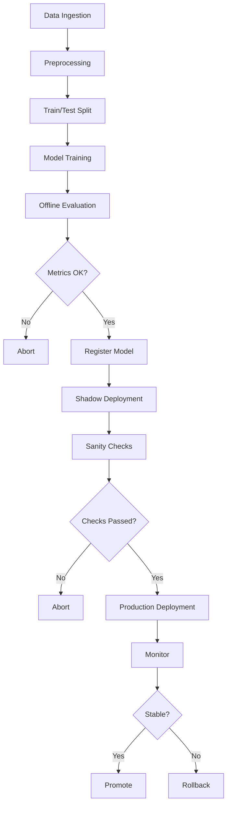

# Automated Retraining Pipeline

> End-to-end, fully automated retraining pipeline on AWS SageMaker for XGBoost lead scoring.

## 1. Introduction

To maintain high lead‑scoring quality as data patterns evolve, we propose a fully automated retraining pipeline on AWS SageMaker. This design ensures proper training orchestration, validation, versioning, deployment, and monitoring.

## 2. Data Handling

### 2.1 Choice of Data Format

**Parquet** over CSV:

* **Columnar storage** → faster read for subsets of features
* **Compression** → lower storage and I/O costs
* **Schema enforcement** → catches type mismatches early

### 2.2 Weekly Data Slicing Approaches

**1. Sliding‑Window Shuffle (7-Day Pool)**

* Aggregate last 7 days; shuffle and split into train/validation/test (e.g., 70/15/15).
* **Pros:** smooths weekly variability in data for training; **Cons:** may mix stale patterns.

**2. Time based Split (4/1/2 Days)**

* Train: Days 1–4; Validate: Day 5; Test: Days 6–7.
* **Pros:** realistic forward‑testing mimics real world inferencing; **Cons:** not trained on latest data

Final Choice: Time-based split (better for real-world sequential data) - and the retraining pipeline is executed on different days of week to make sure it catches weekday and weekend patterns.

## 3. Model Choice & Validation

### 3.1 Model Type

* **XGBRegressor** (ranking/regression) instead of classification

  * Ideal for ranking‑oriented objectives i.e. ordinal regression
  * Directly predicts continuous scores 1–5 and final score can be round off to integers

### 3.2 Evaluation Metric

* **Spearman’s Rank Correlation** aligns with correct lead priority over MAE or MSE.

## 4. Core Retraining Functionality

### 4.1 Training Orchestration

* **SageMaker Pipelines** will be used for orchestration due to their dynamic and robust nature.
* The pipeline will:

  * Fetch new training data.
  * Preprocess features.
  * Train and evaluate the model.
  * Deploy if performance improves.
* **Triggers**:

  * **Weekly schedule** (default).
  * **On-demand** (if data drift is detected).

### 4.2 Model Validation

* **Spearman Correlation** (primary metric) since this is a ranking problem.
* **Secondary metrics:**

  * MAE (Mean Absolute Error) for score calibration.
  * Inference latency (< 1 sec) as performance metric.
* **Validation Strategy:** Time based Split as mentioned in 2.2.
* A model is promoted to the model registry and considered for deployment or comparison against the current production model **only if it passes all validation checks**.

### 4.3 Version Control

* **SageMaker Model Registry** (instead of custom JSON files) for:

  * Model version tracking.
  * Stores Metadata (training date, metrics, hyperparameters).
  * Approval workflows  \[Manual and Automatic] before deployment.

### 4.4 Deployment Strategy

**Step 1: Offline Evaluation on Test Data**
The new (test) model is first evaluated against the current production model using historical test data. Key metrics include:

* **Spearman Correlation** – should increase for better rank-ordering.

**Step 2: Shadow Deployment for Production Sanity Checks**
If the test model shows better performance offline, it is deployed in **shadow mode**:

* Both the test and production models run in parallel.
* Only the production model serves live traffic; the test model receives the same inputs but its outputs are logged.
* Sanity checks during this phase include:

  * Latency under expected thresholds
  * Handling of edge cases
  * No runtime issues (e.g., NaNs, unexpected outputs, failed inferences)
  * General stability in real-world scenarios

**Step 3: Zero-Downtime Cutover**
Once the shadow deployment is successful and confidence in the test model's behavior is established, the final cutover is done using **SageMaker’s blue-green deployment**. This allows seamless switching of endpoints without downtime.

**Rollback Mechanism**
If any issues are detected post-deployment, traffic can be quickly redirected to the previous model using the same deployment framework, ensuring a safe rollback path.

### 5.1 Training Environment

* **Instance Type:** `ml.c4.2xlarge` for training and `ml.t3.medium` for script processing

## 6. Quality Assurance

### 6.1 Data Validation

* **Schema Checks**: Ensure 50 features are present.
* **Statistical Checks**:

  * Missing value and Outliers.
* **Business Rules**:

  * Lead scores must be 1-5.

### 6.2 Performance Metrics

* Spearman Correlation 
* 99th percentile latency (< 1 sec).
* Throughput (\~300 RPS).

### 6.3 Impact Analysis

* **Before Deployment**:

  * Compare test vs. prod on historical data.
* **After Deployment**:

  * **Business Metrics**

    * lead conversion rate - Track and compare how many of the top leads got converted

## 7. Operational Monitoring

### **7.1 Pipeline Status**

* **SageMaker Pipelines + CloudWatch**:

  * Success/failure alerts.

### **7.2 Resource Usage**

* **CloudWatch Metrics**:

  * CPU/GPU utilization.
  * Memory usage.

### **7.3 Data Drift Monitoring**

* **Data Drift**:

  * Weekly feature distribution checks.
  * Trigger retraining if drift detected.

## 8. High‑Level Workflow

## 9. Conclusion

This design ensures automated retraining pipeline for the lead scoring model with:

* Weekly retraining with time-based splits.
* Spearman-driven validation for ranking quality.
* Shadow deployment for safe rollouts.
* SageMaker Pipelines + Model Registry for MLOps efficiency.
* Monitoring for data drift ,cost and business impact metrics.
